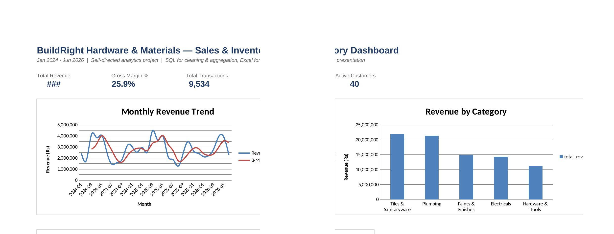

# BuildRight Hardware & Materials — Sales, Inventory & Forecasting Analytics

**Self-directed data analytics project | SQL · Python · Excel**
*By Rupal Tanwar — July 2026*

## Project Overview
BuildRight Hardware & Materials is a modeled building-materials distribution
business (Delhi NCR) — five categories (Paints, Tiles & Sanitaryware,
Plumbing, Electricals, Hardware & Tools), 40 customers across 5 cities, and
~9,500 transactions from Jan 2024 to Jun 2026. The dataset was constructed
with realistic seasonality (pre-monsoon renovation demand spike in
Mar–May, festive spike in Oct–Nov, monsoon slowdown in Jul–Aug) and
intentional data-quality issues (negative quantities, missing discount
values, duplicate transactions) to mirror the kind of messy raw exports
analysts actually receive.

**Goal:** simulate an end-to-end analytics workflow — clean and validate
data, quantify business performance, forecast demand, and present it in a
decision-ready dashboard.



## Methodology

**1. Data Cleaning & Validation (SQL)** — `sql/analysis.sql`
- Identified and removed negative/zero-quantity records (data entry errors)
- Imputed missing discount values
- Detected and removed duplicate transaction records
- Built a clean, de-duplicated `sales_clean` table as the single source of
  truth for all downstream analysis

**2. Business Analysis (SQL)**
- Revenue and gross margin by product category
- Monthly revenue trend across the full 30-month window
- Top 10 products by revenue
- Customer segment contribution (Contractor / Retailer / Individual)
- City-wise performance across the 5-city footprint
- Inventory positions vs. reorder levels

**3. Forecasting (Python)** — `scripts/run_analysis2.py`
- 3-month moving average to smooth seasonal noise
- Linear trend regression to project revenue for the next 3 months

**4. Dashboard (Excel)** — `dashboard/BuildRight_Sales_Dashboard.xlsx`
- KPI summary (Total Revenue, Gross Margin %, Transactions, Active Customers)
- Interactive charts: monthly revenue trend, revenue by category, revenue
  by customer segment
- Underlying summary tables sourced directly from the SQL analysis layer

## Key Findings
- Retailers and Contractors together drive the large majority of revenue,
  with Individual Homeowners a smaller but steady contributor
- Clear, repeatable seasonality: revenue peaks in the Mar–May renovation
  window and again around the Oct–Nov festive season, dipping in the
  monsoon months
- Category-level margins vary meaningfully, which is directly useful for
  where the business should focus promotional effort vs. protect margin

## Repository Structure
```
data/       Raw and derived datasets (products, customers, sales, inventory, forecast)
sql/        Cleaning and analysis queries
scripts/    Python: data generation, SQL execution + forecasting, Excel build
dashboard/  Final Excel dashboard deliverable
charts/     Standalone chart images (revenue trend, category revenue)
```

## Tools Used
SQL (SQLite) · Python (pandas, NumPy, Matplotlib) · Microsoft Excel
(formula-linked summary tables, native charts)

## Note on Data
This dataset is synthetically generated to reflect realistic patterns in
the building-materials distribution sector. It was built to demonstrate
an analytics workflow end-to-end, not to represent any real company's
actual figures.
